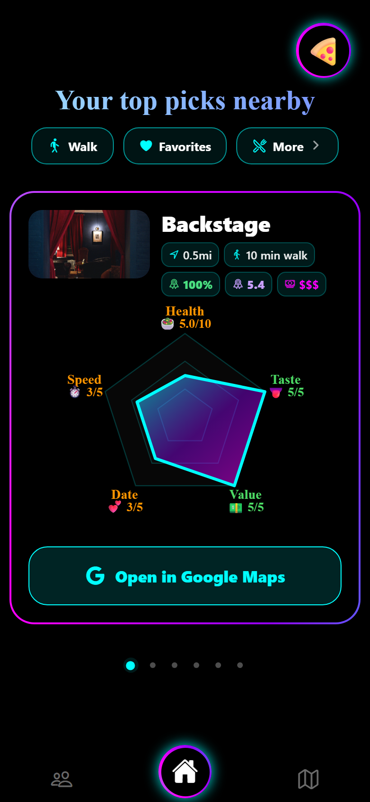
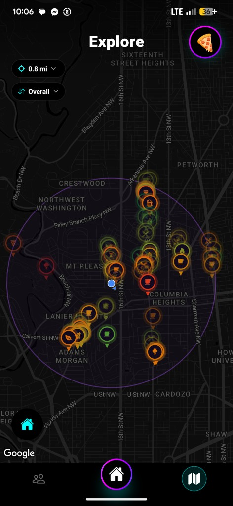
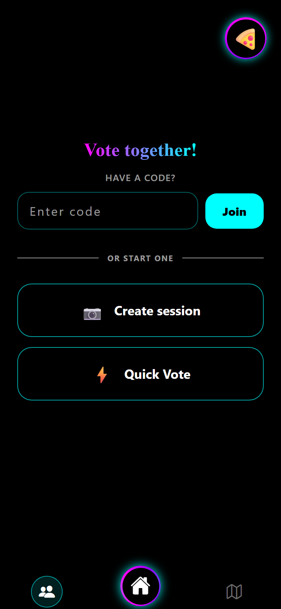
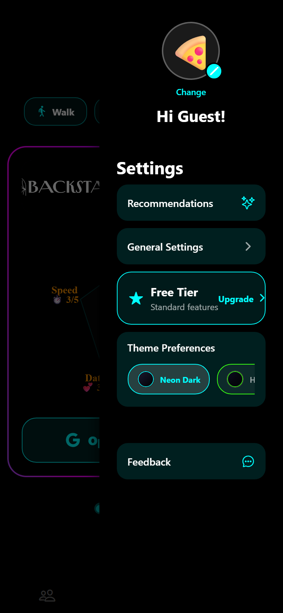
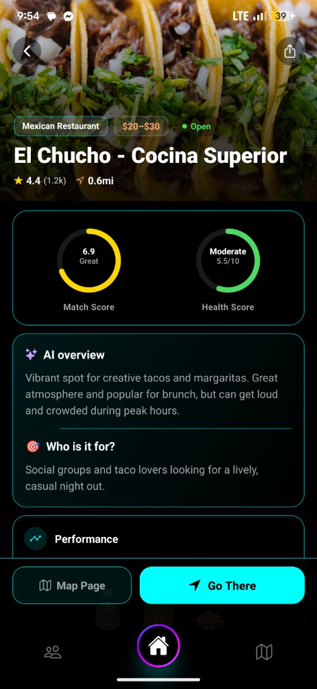

<p align="center">
  
</p>

<h1 align="center">Logic Plate</h1>

<p align="center">
  <strong>Decide where to eat — solo or with friends.</strong><br />
  AI-powered restaurant discovery, map browsing, and group voting in one React Native app.
</p>

<p align="center">
  
  
  
  
</p>

---

## What it does

**Logic Plate** helps you find restaurants nearby, understand them at a glance, and agree on a place with a group.

| Feature | Description |
|---------|-------------|
| **Smart home feed** | Scenario-based filters (date night, quick bite, etc.), swipeable spotlight carousel, Platebound scores, and Gemini-generated AI overviews |
| **Interactive map** | Google Maps with cuisine markers, adjustable search radius, hours/status, and detail sheets |
| **Group decisions** | Create or join a session (pass-the-phone or QR), vote on options, reveal a winner — backed by Supabase realtime |
| **Personalization** | Recommendation prefs, favorites, visit history, themes (including neon), and i18n |

### Screenshots

| Home | Map | Groups |
|:----:|:---:|:------:|
|  |  |  |

| Profile | Detail page |
|:-------:|:-----------:|
|  |  |

---

## Tech stack

| Layer | Technologies |
|-------|----------------|
| **Mobile** | Expo SDK 54, React Native 0.81, Expo Router v6, React 19, TypeScript |
| **UI / motion** | Reanimated 3, Gesture Handler, expo-image, custom theme system, i18next |
| **Backend** | Supabase (PostgreSQL, Auth, Row Level Security, Edge Functions on Deno) |
| **Data & APIs** | Google Places / Maps, Overture Maps, Gemini AI, Foursquare, Unsplash, Open-Meteo |
| **Companion** | Next.js group-vote web app (`platebound-vote/`) on Vercel |
| **Ship** | EAS Build & Submit, local Gradle release AABs (Windows), OTA via expo-updates |

## Implementation highlights

- **Edge-function orchestration** — Restaurant fetch, website scrape cache, photo pipeline, and AI overview generation run server-side with service-role isolation and `x-app-secret` gating.
- **Recommendation engine** — Client-side scoring (prefs, weather, meal type, session budget) over cached place pools with incremental AI enrichment.
- **New Architecture** — React Native New Arch + Reanimated worklets; release builds target arm64-only for lean APK/AAB size.
- **Security hardening** — RLS on v2 tables, group-session policies, no service keys in the app bundle; edge functions read API keys from Supabase secrets only (`GEMINI_API_KEY`, `OVERTURE_MAPS_KEY`, etc. — never hardcoded in source). See [`docs/SECURITY-AUDIT.md`](docs/SECURITY-AUDIT.md) before open-sourcing.
- **Ops scripts** — Overture bbox ingest and AllThePlaces hours enrichment (`scripts/`) for offline data maintenance.

---

## Get started

```bash
npm install
cp .env.example .env   # fill in Supabase + Maps keys
npx expo start --web --port 8081
```

Requires **Node.js 20 LTS**. Location-dependent features need browser geolocation (web) or device permissions (native). The Map tab shows a placeholder on web — use iOS/Android for full map behavior.

See [AGENTS.md](./AGENTS.md) for project layout, lint/typecheck, and the full Windows Android build workflow.

---

## Developer documentation

### Android release — required `gradle.properties` overrides

The `android/` folder is generated by `npx expo prebuild` and is **not committed**. Prebuild resets `android/gradle.properties` to Expo defaults, which builds **all four CPU architectures** and produces APKs around **120 MB** instead of **~60 MB**.

**After every prebuild**, apply these lines in `android/gradle.properties` (repo copy and `C:\platebound` copy if you use the short-path build workaround):

```properties
# Build arm64-only (modern phones). Default prebuild value is armeabi-v7a,arm64-v8a,x86,x86_64
reactNativeArchitectures=arm64-v8a

# Avoid Gradle OOM on release builds
org.gradle.jvmargs=-Xmx4096m -XX:MaxMetaspaceSize=1024m -XX:+HeapDumpOnOutOfMemoryError

# Required for Reanimated / New Architecture (do not disable)
newArchEnabled=true

# Fix duplicate native library from worklets + reanimated
android.packagingOptions.pickFirsts=**/libworklets.so
```

Also pass the architecture flag on the Gradle command (belt-and-suspenders). **Bump `app.json` version fields before every export** (see [Version numbers](#version-numbers-required-before-every-export) below).

```powershell
.\gradlew.bat bundleRelease -PreactNativeArchitectures=arm64-v8a --no-daemon
# or for a sideload APK:
.\gradlew.bat assembleRelease -PreactNativeArchitectures=arm64-v8a --no-daemon
```

#### Quick sanity check after export

| Check | Expected |
|-------|----------|
| APK file size | ~55–65 MB (not ~120 MB) |
| APK `lib/` folders | `arm64-v8a` only |
| AAB on disk | ~45–50 MB (Play Store serves one ABI per device) |

If the APK contains `x86`, `x86_64`, or `armeabi-v7a` under `lib/`, the build included extra architectures — fix `gradle.properties` and rebuild.

### Version numbers (required before every export)

All version fields live in `app.json`. **Always bump these before exporting** — EAS cloud builds, local Gradle APK/AAB exports, and prebuild. Do not start a release build or Gradle export until the version fields are updated, even if you are only building one platform this time.

| Field | `app.json` path | Example | Rule |
|-------|-----------------|--------|------|
| User-facing version | `expo.version` | `3.0` | Increment for each release build (e.g. `2.6` → `3.0`). |
| iOS build number | `expo.ios.buildNumber` | `"4"` | Increment by 1 every build (string). Required for TestFlight / App Store. |
| Android version code | `expo.android.versionCode` | `12` | Increment by 1 every build (integer). Required for Play Store. |

Example before a release:

```json
"version": "3.0",
"ios": { "buildNumber": "4", ... },
"android": { "versionCode": 12, ... }
```

`eas.json` uses `"appVersionSource": "local"`, so EAS reads these values from `app.json` — not from the Expo dashboard.

Package / bundle ID (do not change unless intentionally rebranding):

- **iOS:** `com.twikiastudios.logicplate`
- **Android:** `com.twikiastudios.logicplate`

### EAS cloud builds (iOS TestFlight + Android)

Install EAS CLI and log in once:

```bash
npm install -g eas-cli
eas login
```

Set **production** environment variables on [expo.dev](https://expo.dev/accounts/twikias-organization/projects/platebound/environment-variables) (or `eas env:create`). Required at minimum:

- `EXPO_PUBLIC_SUPABASE_URL`
- `EXPO_PUBLIC_SUPABASE_KEY`
- `EXPO_PUBLIC_APP_SECRET`
- `EXPO_PUBLIC_VOTE_BASE_URL`
- `GOOGLE_MAPS_API_KEY` (and `GOOGLE_MAPS_API_KEY_ANDROID` / `GOOGLE_MAPS_API_KEY_IOS` if split)

#### iOS — TestFlight (recommended)

Uses the `production` profile in `eas.json` (App Store distribution). No device UDID registration.

**One-time setup**

1. Enroll in the [Apple Developer Program](https://developer.apple.com/programs/).
2. Create the app in [App Store Connect](https://appstoreconnect.apple.com) with bundle ID `com.twikiastudios.logicplate`.
3. Configure signing on EAS:
   ```bash
   eas credentials:configure-build -p ios -e production
   ```
   Or use [Expo → Credentials → iOS](https://expo.dev/accounts/twikias-organization/projects/platebound/credentials).
4. Set up submit credentials (App Store Connect API key recommended):
   ```bash
   eas credentials
   ```

**Each release**

1. **Bump version fields in `app.json` first** (see table above). Required every time before export.
2. Build and auto-submit to TestFlight (recommended — uses the App Store Connect API key on EAS; no separate login or manual submit step):
   ```bash
   eas build --platform ios --profile production --auto-submit --no-wait --non-interactive
   ```
   EAS uploads to App Store Connect when the build finishes. Track progress at [expo.dev builds](https://expo.dev/accounts/twikias-organization/projects/platebound/builds).

3. If auto-submit is not configured yet, build only then submit manually:
   ```bash
   eas build --platform ios --profile production --no-wait
   eas submit --platform ios --profile production --latest
   ```
   Or click **Submit** on the build page at [expo.dev](https://expo.dev/accounts/twikias-organization/projects/platebound/builds).

4. In App Store Connect → **TestFlight**, add internal testers (team) or external testers (short review first time).

Track builds: [expo.dev/accounts/twikias-organization/projects/platebound/builds](https://expo.dev/accounts/twikias-organization/projects/platebound/builds)

#### Android — Play Store (EAS cloud)

**Each release**

1. **Bump version fields in `app.json` first** (see table above). Required every time before export.
2. Start a remote build:
   ```bash
   eas build --platform android --profile production --no-wait
   ```
   Outputs an **AAB** for Play Console upload.

3. Submit (optional):
   ```bash
   eas submit --platform android --profile production --latest
   ```

For a sideload **APK** instead, use the `preview` profile (`buildType: apk` in `eas.json`).

#### Android — local release AAB (Windows)

For a local Gradle APK/AAB without EAS credits, see [AGENTS.md](./AGENTS.md) → **Local production AAB build (Windows)**. **Bump `app.json` versions first** (always, before every export), then run `npx expo prebuild` and the `gradle.properties` overrides documented above. Copy outputs to `builds/` with a versioned name (e.g. `platebound-3.0-v12.apk`).

### Build profiles

| Profile | iOS | Android | Use |
|---------|-----|---------|-----|
| `production` | TestFlight / App Store | Play Store AAB | Store releases |
| `preview` | Ad Hoc (device UDIDs) | APK sideload | Internal testing |
| `development` | Ad Hoc + dev client | Dev client | Local `expo start --dev-client` (avoid for TestFlight) |

### Security & open source

Before making this repository public, read [`docs/SECURITY-AUDIT.md`](docs/SECURITY-AUDIT.md) — `.env` was previously committed and must be purged from git history; rotate exposed keys after cleanup.
